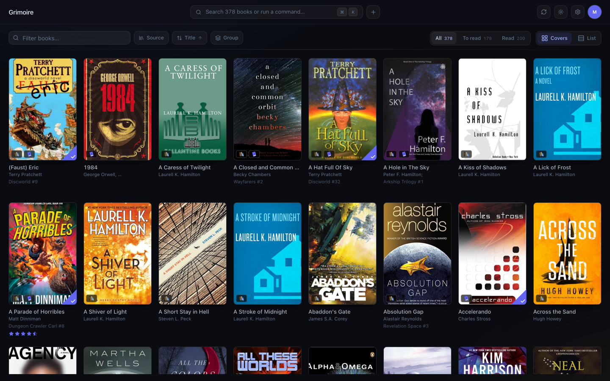
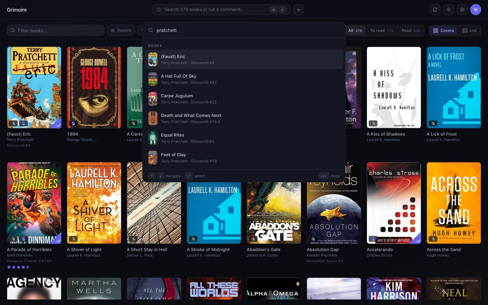
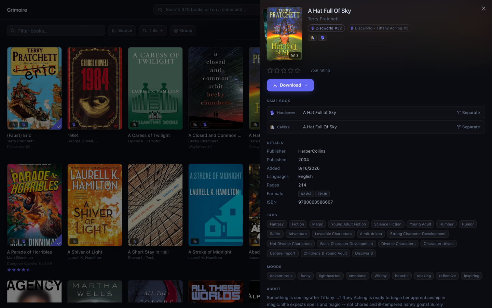
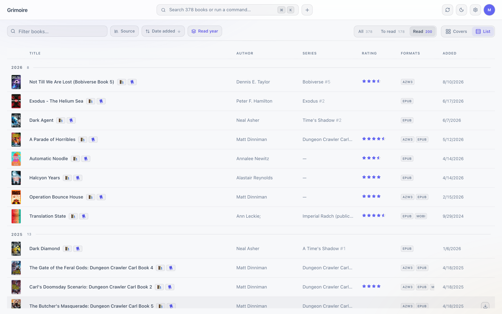
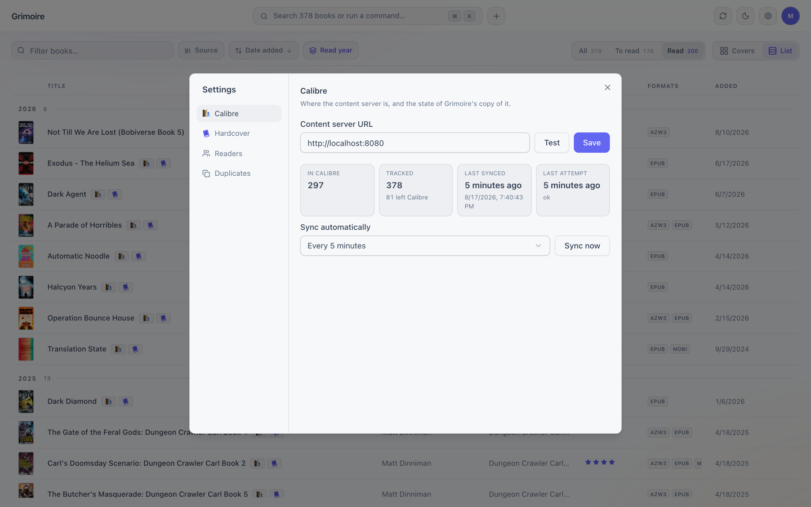

# Grimoire Books

> [!WARNING]
> **Pre-alpha.** The initial feature set isn't finished. Schemas, APIs and
> screens change without migration paths or notice, and there is no
> authentication of any kind. Point it at a Calibre library you can afford to
> re-sync, and don't expose it to a network you don't trust.

A better way to organize and browse your books. Grimoire is a UI over your
[Calibre](https://calibre-ebook.com/) library and your
[hardcover.app](https://hardcover.app) shelves that runs as a native desktop app
(Electrobun), a self-hosted web server, or a local web app, all from the same
codebase.



## Screenshots

Your whole library on one shelf. Filter, sort and group it, and every view is
a URL you can send to someone. `⌘K` searches every book from anywhere, so you
never have to go find the filter box.



A book you own *and* track is one card, not two. The flyout shows the Calibre
row and the Hardcover row Grimoire matched it with, and lets you separate them
if the match is wrong.



The same shelf as a table, here narrowed to what you've read and grouped by the
year you finished it. Light and dark both ship.



Settings is where the sources live: point Grimoire at your Calibre content
server, watch it sync, and link a Hardcover account per reader.



## Sources

Grimoire keeps its own SQLite database and syncs into it, rather than reading a
source live on every screen.

- **Calibre.** Grimoire mirrors a running [content server](#requirements) into
  `grimoire.db`, covers and all, and every library screen reads from there
  ([ADR 0011](docs/adrs/0011-sync-calibre-into-grimoire-db-and-read-the-library-from-there.md)).
  Calibre is still the source of truth for the *files*, and Grimoire never
  writes to it. The long-term goal is to grow Grimoire until it can replace
  Calibre as the backend.
- **Hardcover.** The half Calibre has no idea about: what you've read, are
  reading, and want to read, plus editions, series and covers. Each reader links
  **their own** account with a personal API token, because a token *is* an
  account and the reading history behind it is theirs
  ([ADR 0012](docs/adrs/0012-hardcover-as-a-second-source-with-per-reader-tokens.md)).
  Tokens live server-side only. The browser never holds one, and Hardcover's
  GraphQL API refuses browser calls anyway.

A book you own in Calibre *and* track on Hardcover stays as two rows and renders
as one card: [book matching](docs/features/book-matching.md) groups them under a
`works` row ([ADR 0013](docs/adrs/0013-group-duplicate-books-into-works.md)), and
you can confirm or split a match by hand from the book's details flyout.

Grimoire supports several readers with no login between them
([ADR 0008](docs/adrs/0008-multiple-users-without-authentication.md)). It
assumes a household, not the open internet.

## Layout

```
apps/
  web/       React + Vite + Tailwind 4 + shadcn/ui + TanStack Router/Query — the
             UI, shared by every mode; Storybook for the components
  server/    Standalone Bun server: serves the API + built web UI (hosted mode)
  desktop/   Electrobun shell: embeds the API and loads the same UI natively
packages/
  core/      grimoire.db (Grimoire's own SQLite store) + shared Zod schemas
  api/       Hono app defining the HTTP API, embedded by server and desktop
docs/        OKF 0.2 knowledge bundle: adrs/ · features/ · workflows/ · external/
```

Every deployment mode speaks the same HTTP API (`/api/...`), so the UI doesn't
care where it's running.

## Requirements

- [Bun](https://bun.sh) ≥ 1.3
- A **running Calibre content server.** All library data comes from it, over
  HTTP. Start it with `calibre-server`, or from calibre's Preferences →
  Sharing over the net. Grimoire assumes `http://localhost:8080` until you set
  a URL during first-run setup.
- *Optional:* a **hardcover.app API token** per reader who wants their shelves
  in, from [your Hardcover account settings](https://hardcover.app/account/api).
  Paste it under Settings → Readers and test it before saving. Tokens expire
  after a year.

## Development

```bash
bun install

# Web development: Vite dev server on :4746 (HMR) + API server on :4747
bun dev

# Desktop development: Vite HMR + Electrobun app window
bun run dev:desktop

# Component workshop on :4748
bun run storybook
```

## Building / running for real

```bash
# Hosted mode: build the UI, then run the server (PORT to override :4747)
bun run build:web
bun run start:server

# Desktop app bundle
bun run build:desktop

# Self-hosted container (published releases are at ghcr.io/mikevalstar/grimoire)
docker build -t grimoire .
docker run --rm -p 4747:4747 \
  -v grimoire-data:/data \
  -e CALIBRE_SERVER=http://host.docker.internal:8080 \
  grimoire
```

The container runs as the unprivileged `bun` user, uid 1000, and writes
`grimoire.db` plus the cover cache to `/data`. Docker creates the named volume
above with the right ownership. A bind mount keeps the host directory's
ownership, so give it to that uid first. Otherwise the container refuses to
start and says so:

```bash
sudo mkdir -p /srv/grimoire && sudo chown -R 1000:1000 /srv/grimoire
docker run --rm -p 4747:4747 -v /srv/grimoire:/data grimoire
```

There is no `PUID`/`PGID` handling. Grimoire never needs root at runtime, and
starting as root to chown and drop privileges is more machinery than a one-time
`chown` on the host is worth.

Container environment variables:

| Variable | Default | What it does |
| --- | --- | --- |
| `PORT` | `4747` | Port the server listens on |
| `GRIMOIRE_DATA_DIR` | `/data` | Where `grimoire.db` and cached covers live ([ADR 0007](docs/adrs/0007-user-data-and-asset-storage-location.md)) |
| `CALIBRE_SERVER` | `http://localhost:8080` | Fallback content server URL, until one is saved in settings |

On Linux, add `--add-host=host.docker.internal:host-gateway` when Calibre runs
on the Docker host.

Version tags matching `vX.Y.Z` publish Linux, Windows, and macOS desktop ZIPs,
a multi-architecture GHCR image, and a GitHub Release with generated notes. See
[Cut a release](docs/workflows/cut-a-release.md) for the release process. The
desktop packages are not yet code-signed or notarized.

## Other commands

```bash
bun run typecheck                  # typecheck every workspace
bun run docs:check                 # validate the docs/ OKF bundle (needs okq)
cd apps/web && bunx shadcn@latest add <component>   # add shadcn/ui components
```
